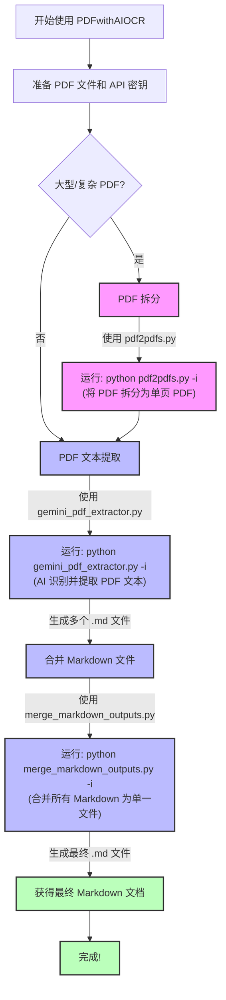

# PDF with AI OCR

## 项目介绍

PDF with AI OCR 是一套高效的多语言 PDF 文本提取工具，利用 Google Gemini AI 强大的视觉识别能力，能够精确提取 PDF 中的各种语言文本，包括中文、英文、日语等混合内容，并保持原始排版格式。

### 主要特点

- 🔍 **高精度文本识别**：利用 Gemini AI 视觉能力提取文本，精确度远超传统 OCR
- 🌐 **多语言支持**：完美支持中文、英文、日语等混合内容
- 📝 **保留原始排版**：保持原文档的格式、段落和布局
- 🔄 **多 API 密钥轮换**：自动在多个 API 密钥之间切换，有效应对配额限制
- 💾 **断点续传功能**：支持中断后从上次处理位置继续
- 📊 **进度监控**：实时显示处理进度和剩余时间估计
- 📘 **Markdown 输出**：生成规范的 Markdown 文件，便于后续处理

### 流程概览




## 安装说明

### 前提条件

- Python 3.8 或以上版本
- Google AI Studio API 密钥 (获取方法见下文)
- 如果在中国大陆，需要可以访问 Google 服务的网络环境

### 1. 下载项目

```bash
git clone https://github.com/buynonsense/PDFwithAIOCR.git
cd PDFwithAIOCR
```

或者直接从 GitHub 下载 ZIP 文件并解压。

### 2. 安装依赖

```bash
pip install -r requirements.txt
```

### 3. 获取 Google AI Studio API 密钥

1. 访问 [Google AI Studio](https://makersuite.google.com/app/apikey)
2. 登录您的 Google 账号
3. 点击"创建 API 密钥"按钮
4. 复制生成的 API 密钥
5. 将 API 密钥保存到文本文件中，例如 `api_keys.txt`（每行一个密钥）

## 使用指南（适合新手）

### 【步骤一】准备 PDF 文件

1. 创建一个文件夹（例如 `pdf_files`），将您想要处理的 PDF 文件放入其中
2. 确保 PDF 文件名不含特殊字符，最好使用英文和数字

### 【步骤二】设置 API 密钥

1. 创建一个文本文件 `api_keys.txt`
2. 每行粘贴一个 Google AI Studio API 密钥
3. 保存文件到项目目录下

### 【步骤三】提取 PDF 文本（交互模式）

在命令行中运行：

```bash
python gemini_pdf_extractor.py -i
```

程序将启动交互模式，引导您输入所有必要参数：

1. **输入 PDF 文件夹路径**：输入存放 PDF 文件的文件夹路径
2. **输入 API 密钥文件路径**：输入 `api_keys.txt` 的路径
3. **选择输出文件夹**：指定存储结果的文件夹
4. **选择是否使用代理**：如果在中国大陆需要设置代理，例如 `http://localhost:7890`
5. 确认设置后，程序将开始处理 PDF 文件

### 【步骤四】合并提取结果

提取完成后，可以将所有生成的 Markdown 文件合并为一个文件：

```bash
python merge_markdown_outputs.py -i
```

同样，程序将引导您输入必要参数：

1. **输入 Markdown 文件夹路径**：输入上一步输出的文件夹路径
2. **输入合并后的输出文件路径**：指定合并后文件的保存位置
3. **输入合并文档的标题**：设置合并后文档的主标题
4. **选择其他选项**：如是否添加文件标题、分隔线等

## 命令行参数说明

### gemini_pdf_extractor.py

```bash
python gemini_pdf_extractor.py --help
```

主要参数：

- `--api-key`: 单个 Google API 密钥
- `--key-file`: 包含多个 API 密钥的文件路径
- `--pdf-folder`: PDF 文件所在文件夹（必需）
- `--output-folder`: 输出结果保存文件夹（必需）
- `--proxy`: 代理服务器地址，例如 http://localhost:7890
- `--no-proxy`: 不使用任何代理
- `--resume`: 从上次中断位置继续处理
- `-i`, `--interactive`: 启动交互模式

### merge_markdown_outputs.py

```bash
python merge_markdown_outputs.py --help
```

主要参数：

- `--input-folder`: 包含 Markdown 文件的文件夹路径
- `--output-file`: 合并后输出的文件路径
- `--title`: 合并文档的标题
- `--no-headers`: 不为每个文件添加标题
- `--no-separator`: 不在文件之间添加分隔线
- `-i`, `--interactive`: 启动交互模式

## 常见问题解答

### 1. 如何处理网络连接问题？

如果您在中国大陆访问 Google API，可能需要设置代理：

```bash
python gemini_pdf_extractor.py --pdf-folder ./pdf_files --output-folder ./output --key-file ./api_keys.txt --proxy http://localhost:7890
```

### 2. API 密钥配额限制了怎么办？

Google AI Studio 的免费 API 密钥有每分钟和每天的配额限制。解决方法：
- 准备多个 Google 账号，获取多个 API 密钥
- 在 `api_keys.txt` 中每行放一个密钥
- 程序会自动在密钥之间轮换

### 3. 处理大型 PDF 时内存不足怎么办？

您可以限制处理范围：

```bash
python gemini_pdf_extractor.py --pdf-folder ./pdf_files --output-folder ./output --key-file ./api_keys.txt --start 0 --end 10
```

这样只会处理前 10 个 PDF 文件。

### 4. 如何恢复中断的处理？

添加 `--resume` 参数即可从上次中断位置继续：

```bash
python gemini_pdf_extractor.py --pdf-folder ./pdf_files --output-folder ./output --key-file ./api_keys.txt --resume
```

### 5. 处理速度太慢怎么办？

- 确保使用稳定的网络连接和高速代理
- 使用多个 API 密钥以避免触发速率限制
- PDF 文件过大时，考虑先拆分后处理

## 项目目录结构

```
PDFwithAIOCR/
├── gemini_pdf_extractor.py   # 主要提取工具
├── merge_markdown_outputs.py # Markdown合并工具
├── pdf2pdfs.py              # PDF拆分工具（高级用户）
├── requirements.txt         # 依赖项列表
├── README.md                # 本文档
└── api_keys.txt             # 存放API密钥（需自行创建）
```

## 提示与建议

1. **API 密钥管理**：不要公开分享您的 API 密钥，它与您的 Google 账号关联
2. **处理大文件**：对于大型 PDF，建议先将其拆分为多个小文件处理
3. **关注日志**：程序会生成详细的日志，帮助您排除可能的问题
4. **格式微调**：生成的 Markdown 可能需要根据实际情况进行微调
5. **批量处理**：对于大量 PDF，可以考虑编写批处理脚本自动处理

## 高级用法：PDF 拆分（可选）

有些 PDF 可能过于复杂，可以先拆分为单页以获得更好的识别效果：

```bash
python pdf2pdfs.py -i
```

这将引导您将复杂的 PDF 拆分为单页 PDF，然后再使用主程序处理。

## 贡献与支持

欢迎提交问题和改进建议！如果您发现任何 bug 或有好的想法，请在 GitHub 上提交 Issue 或 Pull Request。

---